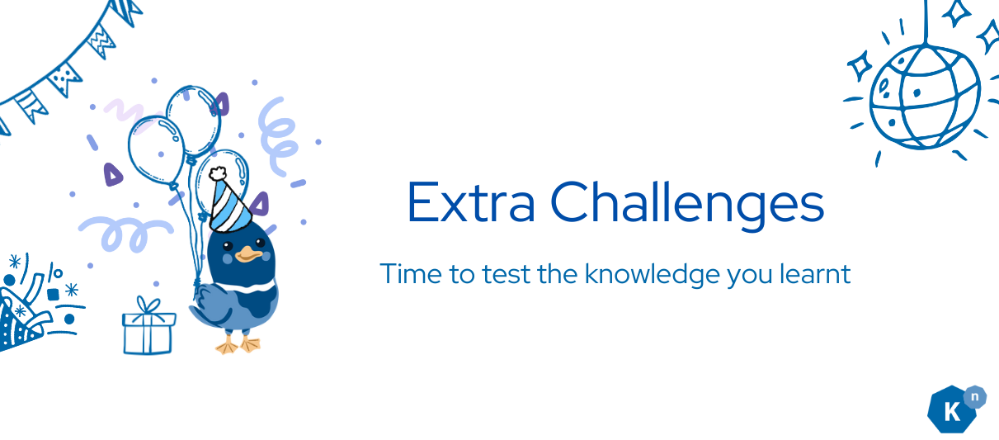
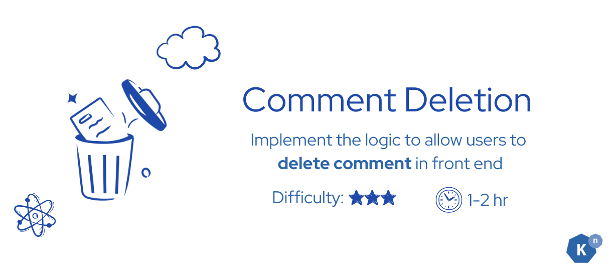
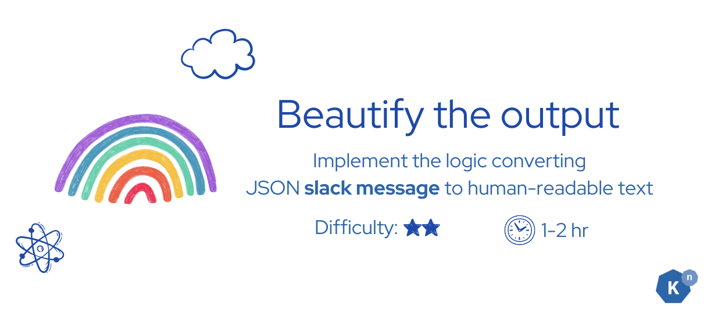
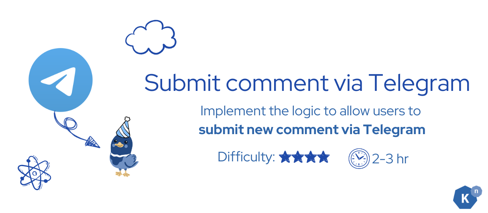

# **Extra Challenges**

Congratulations on completing the bookstore tutorial! Kubernetes and Knative have a high learning curve due to their complexity, but you did it! You should be proud of your accomplishment.

Now it's time to test your mastery of the skills you've learned with Kuack. We've prepared a few extra challenges for you to explore. Take a look and have fun!

## **Challenge 1: Integrate with Another Notification Service as Sink (Telegram)**

**Description**

Add Telegram notifications for new comments using Apache Camel.

**Objective**

Send Telegram notifications for new comments.

**Steps**

1. Create a new event type or filter attribute for Telegram notifications.
2. Set up a trigger to route these events to a Camel-K integration service.
3. Use Apache Camel to send messages to a Telegram chat by setting up the telegram-sink.

**What You Will Learn**

- Integrating with external notification services using Apache Camel.
- Using triggers to route specific events.
- Working with the Telegram API.

**Estimated Time**

0.5-1 hours

## **Challenge 2: Implement Comment Deletion**

**Description**

Add functionality to delete comments from the database using an event-driven approach.

**Objective**

Allow users to delete the selected comment.

**Steps**

1. Create a new event type for comment deletion.
2. Set up a trigger to listen for deletion events.
3. Implement a function in the node-server to handle the deletion and update the database.

**What You Will Learn:**

- Creating and handling new event types.
- Setting up triggers for specific events.
- Performing database operations based on events.

**Estimated Time**

1-2 hours

## **Challenge 3: Format the Output for the Sink**

**Description**

Learn how to create an event consumer app that formats event data before sending it to a sink.

**Objective**

Transform event data and send it to the appropriate sink.

**Steps**

1. Create a new function in node-server to consume and transform events.
2. Set up a trigger to route events (Event X - unformatted) to this transformation service.
3. Implement the transformation logic to convert Event X into Event Y - formatted.
4. Configure the service to send the transformed event (Event Y) to the Slack sink.
5. Ensure the function replies with the transformed event.

**What You Will Learn**

- Creating an event consumer app.
- Adding a new step in a sequence to process events.
- Transforming events within a service and routing the transformed events to a sink.
- Using triggers and functions with replies in an event-driven architecture.

**Estimated Time**

1-2 hours

## **Challenge 4: Submit Comments via Telegram**

**Description**

Enable users to submit new comments through a Telegram bot using Apache Camel.

**Objective**

Allow users to send comments via Telegram.

**Steps**

1. Create a Telegram bot and obtain the bot token.
2. Set up an [Apache Camel Telegram source](https://camel.apache.org/camel-kamelets/4.4.x/telegram-source.html) to listen for messages from the Telegram bot.
3. Create a new event type for comments received via Telegram.
4. Set up a trigger to process these events and route them to the comment handling service.
5. Implement a function in the node-server to handle the new comments and update the database.

**What You Will Learn**

- Creating and configuring a Telegram bot.
- Using Apache Camel to integrate Telegram as an event source with your application.
- Handling new event types and processing user input from external sources.

**Estimated Time**

2-3 hours

## **Help**

Join the supportive Knative community via the Cloud Native Computing Foundation (CNCF) Slack, particularly the [#knative](https://cloud-native.slack.com/archives/C04LGHDR9K7){:target="_blank"} channel. Before posting your questions, please search to see if they've already been answered. Your feedback on this tutorial is invaluable, so don't hesitate to reach out with suggestions or questions.