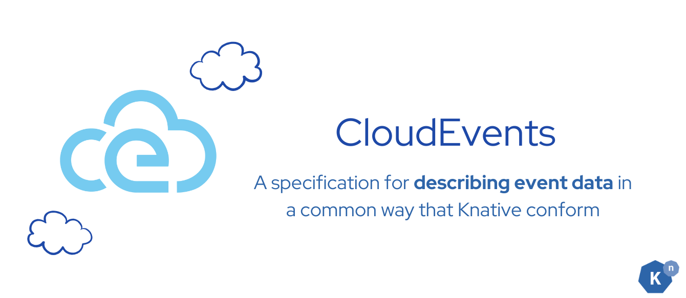
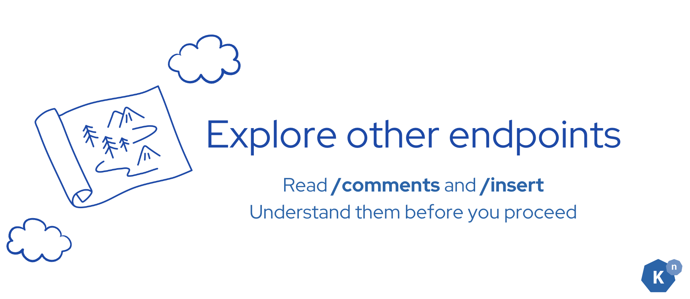
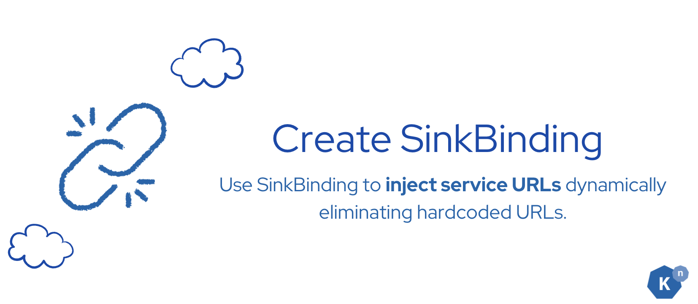
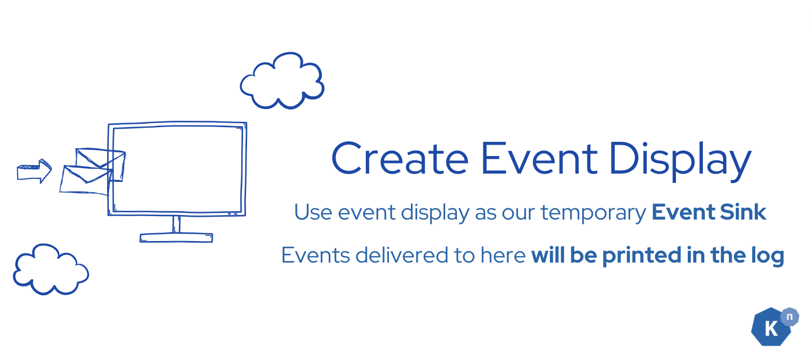
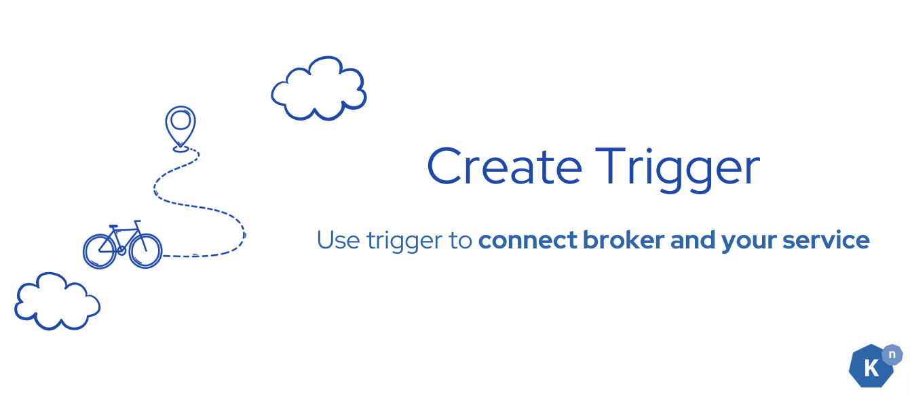
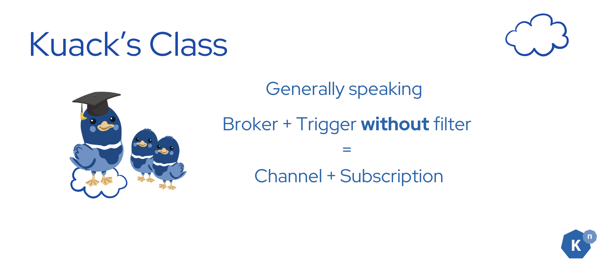
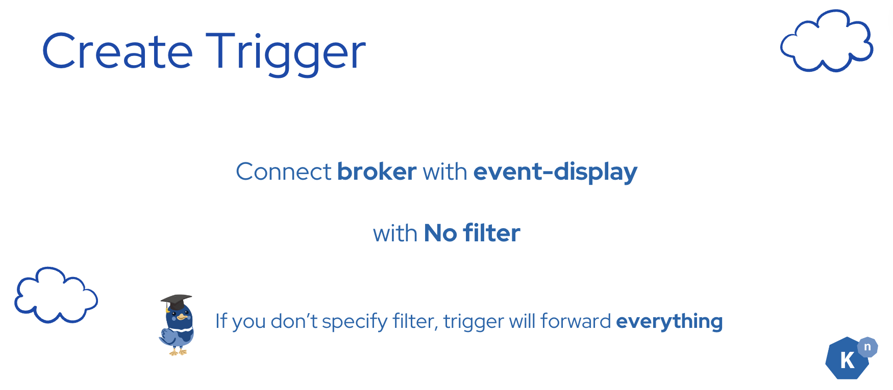

# Send Review Comment to Broker


The main dashboard of our bookstore features a comment section where readers can view comments from others and submit their own through a text input area. While the process appears straightforward—click a button, and the comment is posted—the underlying mechanism is powered by a robust event-driven architecture.

## **What Knative features will we learn about?**

- Knative Eventing Broker
- Knative Eventing Sink
- Knative SinkBinding
- Use Event Display to help with debugging

## **What does the deliverable look like?**


In simple words: after the user clicks on the submit button in the frontend, the comment will show up in the event-display service.

## **Implementation**

### **Step 0: Know the basics**



In the world of microservices and REST APIs, we often refer to requests as the primary method of communication between services. However, in an event-driven architecture, the smallest unit is an event. Knative Eventing adheres to the CloudEvents specification, making it essential to understand this concept before moving forward. Learn more about CloudEvents [here](https://cloudevents.io/){:target="_blank"} before proceeding!

### **Step 1: Understand Book Review Service**


The book review service is our Node.js API server, playing a crucial role in our event-driven architecture. It's essential to understand how it operates, as it receives events and processes them appropriately.


**Key Concepts: Broker and SinkBinding**

Before we dive into the code, let's clarify two important concepts: Broker and SinkBinding. **It’s okay if you don’t fully understand it yet!** You will get a deeper understanding along the way.

- **Broker**: Acts as the central point in the event-driven architecture, routing events to the correct destinations. The broker's address is not fixed and can vary.
- **SinkBinding**: This Knative Eventing component automatically injects the broker's address into the environment variable `K_SINK`, ensuring that the Node.js server always has the correct address without manual updates.


Let's examine the `node-server/index.js` file, starting with the `/add` function. When a user submits a comment through the frontend, it is first received by this endpoint.

```javascript
app.post('/add', async (req, res) => {
  try {
    const receivedEvent = HTTP.toEvent({headers: req.headers, body: req.body});
    const brokerURI = process.env.K_SINK;

    if (receivedEvent.type === 'new-review-comment') {
      const response = await fetch(brokerURI, {
        method: 'POST',
        headers: {
          'Content-Type': 'application/cloudevents+json',
          'ce-specversion': receivedEvent.specversion,
          'ce-type': receivedEvent.type,
          'ce-source': receivedEvent.source,
          'ce-id': receivedEvent.id,
        },
        body: JSON.stringify(receivedEvent.data),
      });
    }
  } catch (err) {
    console.error(err);
  }
});
```

**Receiving Events**: The `/add` endpoint receives events from the frontend. It uses CloudEvents' SDK to convert the incoming request into a CloudEvent object:

```javascript
const receivedEvent = HTTP.toEvent({headers: req.headers, body: req.body});
```

**Determining Broker Address**: The broker's address is dynamically assigned in the cluster. The Node.js server retrieves this address from the environment variable `K_SINK`:

```javascript
const brokerURI = process.env.K_SINK;
```

You may wonder who told the environment variable about the address? That’s Knative SinkBinding.

**Event Filtering**: The service checks the event type. If it's a `new-review-comment`, it forwards the event to the broker:

```javascript
if (receivedEvent.type === 'new-review-comment') {
  // logic that forwards the event, see below
}
```

**Forwarding Events Logic**: The event is forwarded to the broker with the appropriate CloudEvent headers:

```javascript
const response = await fetch(brokerURI, {
  method: 'POST',
  headers: {
    'Content-Type': 'application/cloudevents+json',
    'ce-specversion': receivedEvent.specversion,
    'ce-type': receivedEvent.type,
    'ce-source': receivedEvent.source,
    'ce-id': receivedEvent.id,
  },
  body: JSON.stringify(receivedEvent.data),
});
```



**Exploring Other Functions**

The Node.js server contains other functions that follow a similar pattern, with detailed comments explaining their functionality:

- `/insert`: Receives CloudEvents and inserts the payload into the PostgreSQL database.
- `/comment`: Creates a WebSocket connection with the frontend to transport comments from the database.

### **Step 2: Create Broker**


The Broker acts as a router in your event-driven application, receiving events and routing them to the correct destination.


- 1: Create a new YAML file named `node-server/config/200-broker.yaml` and add the following content:

???+ abstract "_node-server/config/200-broker.yaml_"
    ```yaml
    apiVersion: eventing.knative.dev/v1
    kind: Broker
    metadata:
    name: bookstore-broker
    ```

- 2: Apply the YAML file:

```bash
kubectl apply -f node-server/config/200-broker.yaml
```


Alternatively, use the [Knative CLI `kn`](https://knative.dev/docs/client/#kn) to create the broker:

```bash
kn broker create bookstore-broker
```


???+ success "Verify"

    ```bash
    kubectl get brokers
    ```

    


???+ bug "Troubleshooting"

    If there are issues, use the following command to diagnose:

    ```bash
    kubectl describe broker bookstore-broker
    ```

### **Step 3: Create SinkBinding between Node.js server and broker**



Hardcoding URLs to connect with Kubernetes services in your application can be limiting and inflexible. SinkBinding dynamically injects the URL of the Kubernetes service into your application.

Learn more about SinkBinding [here](https://knative.dev/docs/eventing/custom-event-source/sinkbinding/) and the [spec schema](https://knative.dev/docs/eventing/custom-event-source/sinkbinding/reference/)!

**Create a SinkBinding:**

- 1: Create a new YAML file named `300-sinkbinding.yaml` in the `node-server/config` folder and add the following content:

???+ abstract "_node-server/config/300-sinkbinding.yaml_"
    ```yaml
    apiVersion: sources.knative.dev/v1
    kind: SinkBinding # SinkBinding is a Knative Eventing custom resource
    metadata:
    name: node-sinkbinding
    namespace: default
    spec:
    subject: # The subject is where we hope to inject the Sink URI
        apiVersion: apps/v1
        kind: Deployment
        selector:
        matchLabels:
            app: node-server
    sink: # The Sink is the URI of the Broker
        ref:
        apiVersion: eventing.knative.dev/v1
        kind: Broker
        name: bookstore-broker
    ```

- 2: Apply the YAML file:

```bash
kubectl apply -f node-server/config/300-sinkbinding.yaml
```


???+ success "Verify"

    ```bash
    kubectl get sinkbindings
    ```

    

### **Step 4: Create event-display service**



Event display is a debugging tool in Knative Eventing that allows you to use it as a temporary destination (a.k.a sink) for your event to go.

**Create an Event Display Service:**

- 1: Create a new YAML file named `100-event-display.yaml` in the `node-server/config` folder and add the following content:

???+ abstract "_node-server/config/100-event-display.yaml_"

    ```yaml
    apiVersion: apps/v1
    kind: Deployment
    metadata:
    name: event-display
    spec:
    replicas: 1
    selector:
        matchLabels:
        app: event-display
    template:
        metadata:
        labels:
            app: event-display
        spec:
        containers: # Using the pre-built image from Knative
        - name: event-display
            image: gcr.io/knative-releases/knative.dev/eventing-contrib/cmd/event_display
            ports:
            - containerPort: 8080
    ---
    apiVersion: v1
    kind: Service
    metadata:
    name: event-display
    spec:
    selector:
        app: event-display
    ports:
    - protocol: TCP
        port: 80
        targetPort: 8080
    type: ClusterIP
    ```

- 2: Apply the YAML file:

```bash
kubectl apply -f node-server/config/100-event-display.yaml
```


???+ success "Verify"

    ```bash
    kubectl get pods
    ```

    You should see the pod `event-display-XXXXXXX-XXXXX` in "Running" status.
    

### **Step 5: Create trigger that connects the broker and event display**



Trigger is able to forward the event to the correct destination based on the [CloudEvent’s attributes](https://knative.dev/docs/eventing/#:~:text=Knative%20Eventing%20uses%20standard%20HTTP%20POST%20requests%20to%20send%20and%20receive%20events%20between%20event%20producers%20and%20sinks.%20These%20events%20conform%20to%20the%20CloudEvents%20specifications,%20which%20enables%20creating,%20parsing,%20sending,%20and%20receiving%20events%20in%20any%20programming%20language.). It is the connector between the broker and the event destination.

Filter in the trigger will **filter the events based on the filter condition**. You will specify your filter condition in the trigger’s YAML file. **If no filter is specified, the trigger will forward all the events that the broker received.**



There is also a concept called [Channel](https://knative.dev/docs/eventing/channels/) in Knative, and generally speaking, you can treat Broker + Triggers without filter the same as Channel + Subscription.

Learn more about Broker + Trigger [here](https://knative.dev/docs/eventing/brokers/)!

**Create a Trigger:**


Here we are creating a trigger that will send all the events to event-display.



- 1: Create a new YAML file named `200-log-trigger.yaml` and add the following content:

???+ abstract "_node-server/config/200-log-trigger.yaml_"
    ```yaml
    # This Trigger subscribes to the Broker and filters events based on the type and badwordfilter attribute.
    # Those comments that contain insults are filtered out by the badwordfilter attribute and they will be redirected to the event-display Service.
    apiVersion: eventing.knative.dev/v1
    kind: Trigger
    metadata:
    name: log-trigger
    spec:
    broker: bookstore-broker
    subscriber:
        ref:
        apiVersion: v1
        kind: Service
        name: event-display
    ```

- 2: Apply the YAML file:

```bash
kubectl apply -f 200-log-trigger.yaml
```


???+ success "Verify"

    ```bash
    kubectl get triggers
    ```
    The trigger `log-trigger` should have `READY` status as `True`.

    

### **Validate**


Open the log for event-display with the following command:

```bash
kubectl logs event-display-XXXXX -f
```

???+ success "Verify"
    Type something in the comment box in the UI and click the submit button. The comment should appear in the event-display service with the following output:

    ```plaintext
    ☁️  cloudevents.Event
    Validation: valid
    Context Attributes,
    specversion: 1.0
    type: new-review-comment
    source: bookstore-eda
    id: unique-comment-id
    datacontenttype: application/json
    Extensions,
    knativearrivaltime: 2024-05-19T05:27:36.232562628Z
    Data,
    {
        "reviewText": "test"
    }
    ```

### **Next Step**


Please make sure you pass the Validate test before proceeding. 

[Go to Deploy ML workflow: Sentiment Analysis :fontawesome-solid-paper-plane:](../../bookstore/page-2/pg2-sentiment-svc.md){ .md-button .md-button--primary }