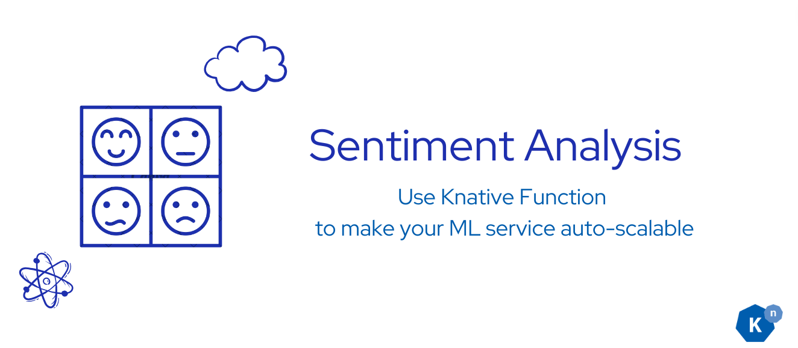
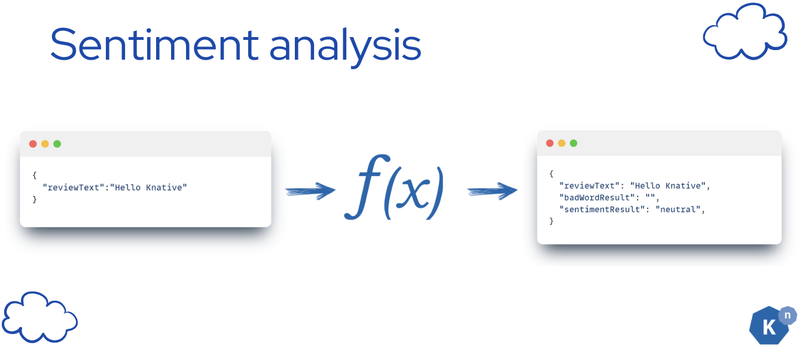
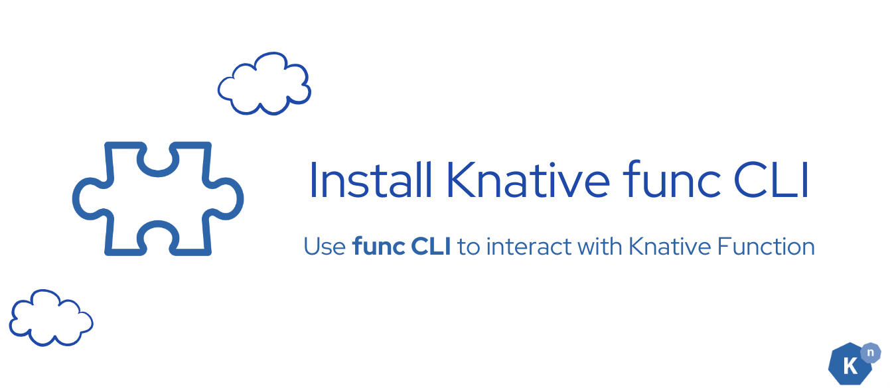
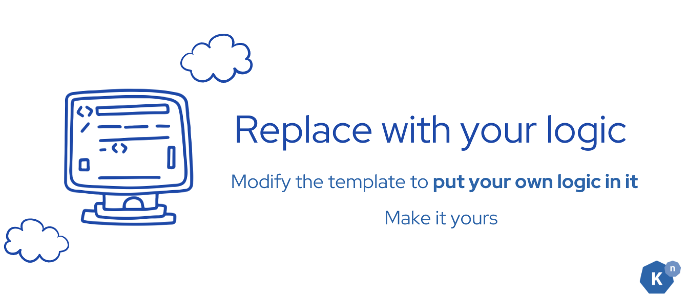
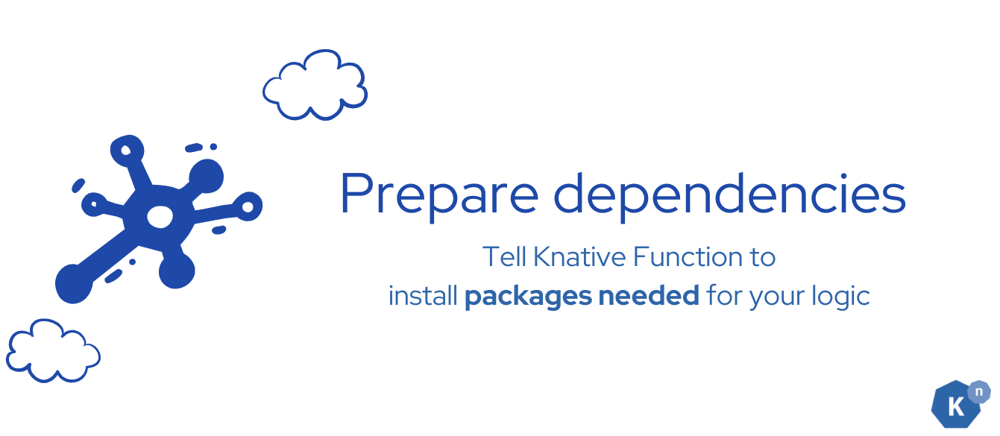
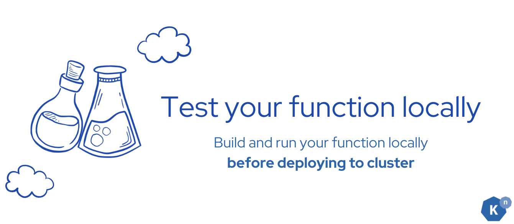
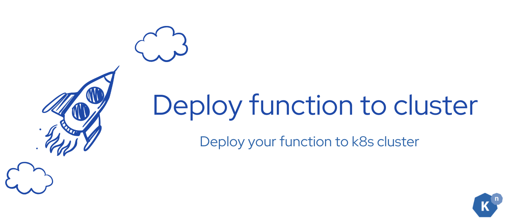
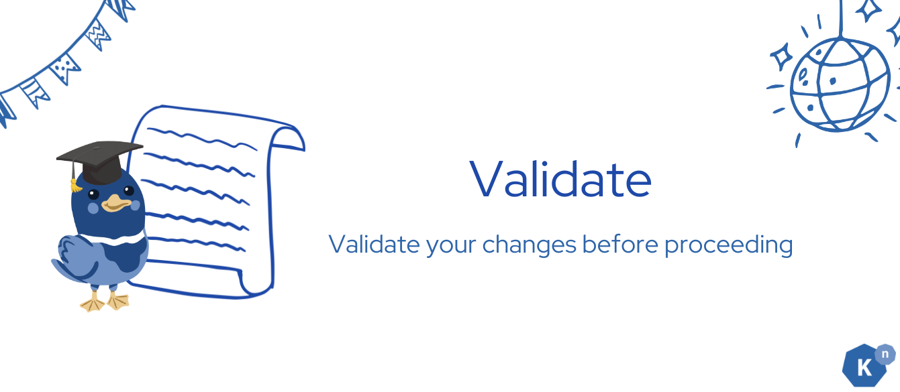

# Sentiment Analysis Service for Bookstore Reviews



As a bookstore owner, you aim to receive instant notifications in a Slack channel whenever a customer submits a new negative review comment. By leveraging Knative Function, you can set up a serverless function that contains a simple sentiment analysis service to categorize review comments by sentiment.

## **What Knative features will we learn about?**

- The ease to use **Knative Function** to deploy your service, and make it be managed by Knative Serving, which gives you the ability to **auto-scale your service to zero**, and scale up to handle the demand.

## **What does the final deliverable look like?**



A running serverless Knative function that contains a python application that receives the new review comments as CloudEvent and returns the sentiment classification of the input text as CloudEvent.

The function's output will be only from:

- Positive

- Neutral

- Negative

## **Install Prerequisites**

### **Prerequisite 1: Install Knative func CLI**



Knative Function enables you to easily create, build, and deploy stateless, event-driven functions as [Knative Services](https://knative.dev/docs/serving/services/#:~:text=Knative%20Services%20are%20used%20to,the%20Service%20to%20be%20configured) by using the func CLI.

In order to do so, you need to install the func CLI. You can follow the [official documentation](https://knative.dev/docs/getting-started/install-func/) to install the func CLI.

???+ success "Verify"
    Running `func version` in your terminal to verify the installation, and you should see the version of the func CLI you installed.

???+ bug "Troubleshooting"
    If you see `command not found`, you may need to add the func CLI to your PATH.

## **Implementation**


The process is straightforward:

1. Begin by utilizing the `func create` command to generate your code template.

2. Next, incorporate your unique code into this template.

3. Finally, execute `func deploy` to deploy your application seamlessly to the Kubernetes cluster.

This workflow ensures a smooth transition from development to deployment within the Knative Functions ecosystem.

### **Step 1: Create a Knative Function template**


Create a new function using the func CLI:

```
func create -l <language> <function-name>
```

In this case, we are creating a python function, so the command will be:

```
func create -l python sentiment-analysis-app
```

This command will create a new directory with the name `sentiment-analysis-app` and a bunch of files in it. The func CLI will generate a basic function template for you to start with.

You can find all the supported language templates [here](https://knative.dev/docs/functions/).

???+ success "Verify"

    The file tree will look like this:

    ```
    sentiment-analysis-app
    ├── func.yaml
    ├── .funcignore
    ├── .gitignore
    ├── requirements.txt
    ├── app.sh
    ├── test_func.py
    ├── README.md
    ├── Procfile
    └── func.py
    ```

### **Step 2: Replace the generated code with the sentiment analysis logic**



`func.py` is the file that contains the code for the function. You can replace the generated code with the sentiment analysis logic. You can use the following code as a starting point:

???+ abstract "_sentiment-analysis-app/func.py_"

    ```python
    from parliament import Context
    from flask import Request, request, jsonify
    import json
    from textblob import TextBlob
    from time import sleep
    from cloudevents.http import CloudEvent, to_structured

    # The function to convert the sentiment analysis result into a CloudEvent
    def create_cloud_event(inputText, badWordResult, data):
        attributes = {
            "type": "moderated-comment",
            "source": "sentiment-analysis",
            "datacontenttype": "application/json",
            "sentimentResult": data,
            "badwordfilter": badWordResult,
        }

        # Put the sentiment analysis result into a dictionary
        data = {
            "reviewText": inputText,
            "badWordResult": badWordResult,
            "sentimentResult": data,
        }

        # Create a CloudEvent object
        event = CloudEvent(attributes, data)
        return event

    def analyze_sentiment(text):
        analysis = TextBlob(text["reviewText"])
        sentiment = "neutral"

        if analysis.sentiment.polarity > 0:
            sentiment = "positive"
        elif analysis.sentiment.polarity < 0:
            sentiment = "negative"

        badWordResult = ""
        try:
            badWordResult = text["badWordResult"]
        except:
            pass

        # Convert the sentiment into a CloudEvent
        sentiment = create_cloud_event(text["reviewText"], badWordResult, sentiment)
        return sentiment

    def main(context: Context):
        """
        Function template
        The context parameter contains the Flask request object and any
        CloudEvent received with the request.
        """

        print("Sentiment Analysis Received CloudEvent: ", context.cloud_event)

        # Add your business logic here
        return analyze_sentiment(context.cloud_event.data)
    ```

### **Step 3: Configure the dependencies**



The `requirements.txt` file contains the dependencies for the function. You can add the following dependencies to the `requirements.txt` file:
???+ abstract "_sentiment-analysis-app/requirements.txt_"

    ```
    Flask==3.0.2
    textblob==0.18.0.post0
    parliament-functions==0.1.0
    cloudevents==1.10.1
    ```

Knative function will automatically install the dependencies listed here when you build the function.

### **Step 4: Configure the pre-built environment**


In order to properly use the `textblob` library, you need to download the corpora, which is a large collection of text data that is used to train the sentiment analysis model. You can do this by creating a new file called `setup.py`, knative function will ensure that the `setup.py` file is executed after the dependencies have been installed.

The `setup.py` file should contain the following code for your bookstore:
 
???+ abstract "_sentiment-analysis-app/setup.py_"
    ```python
    from setuptools import setup, find_packages
    from setuptools.command.install import install
    import subprocess

    class PostInstallCommand(install):
        """Post-installation for installation mode."""
        def run(self):
            # Call the superclass run method
            install.run(self)
            # Run the command to download the TextBlob corpora
            subprocess.call(['python', '-m', 'textblob.download_corpora', 'lite'])

    setup(
        name="download_corpora",
        version="1.0",
        packages=find_packages(),
        cmdclass={
            'install': PostInstallCommand,
        }
    )
    ```

### **Step 5: Try to build and run your Knative Function locally (Optional)**
??? info "Click here to expand"
    
    
    
    
    In knative function, there are two ways to build: using the [pack build](https://github.com/knative/func/blob/8f3f718a5a036aa6b6eaa9f70c03aeea740015b9/docs/reference/func_build.md?plain=1#L46) or using the [source-to-image (s2i) build](https://github.com/knative/func/blob/4f48549c8ad4dad34bf750db243d81d503f0090f/docs/reference/func_build.md?plain=1#L43).
    
    Currently. only the s2i build is supported if you need to run setup.py. When building with s2i, the `setup.py` file will be executed automatically after the dependencies have been installed.
    
    Before we get started, configure the container registry to push the image to the container registry. You can use the following command to configure the container registry:
    
    ```
    export FUNC_REGISTRY=<your-container-registry>
    ```
    
    In this case, we will use the s2i build by adding the flag `-b=s2i`, and `-v` to see the verbose output.
    
    ```
    func build -b=s2i -v
    ```
    
    When the build is complete, you will see the following output:
    
    ```
    🙌 Function built: <Your container registry username>/sentiment-analysis-app:latest
    ```
    
    This command will build the function and push the image to the container registry. After the build is complete, you can run the function using the following command:
    
    ---
    
    **Troubleshooting**
    
    `❗Error: '/home/Kuack/Documents/knative/docs/code-samples' does not contain an initialized function`
    
    **Solution: You may want to check whether you are in the correct directory. You can use the following command to check the current directory. If you are in the right directory, and the error still occurs, try to check your func.yaml, as it has to contain the field `created` and the right time stamp to be treated as a valid knative function.**
    
    ---
    
    ```
    func run -b=s2i -v
    ```
    
    In the future, you can skip the step of `func build`, because func run will automatically build the function for you.
    
    You will see the following output if the function is running successfully:
    
    ```
    ❗function up-to-date. Force rebuild with --build
    Running
    
     on host port 8080
    ---> Running application from script (app.sh) ...
    ```
    
    Knative function has an easy way to simulate the CloudEvent, you can use the following command to simulate the CloudEvent and test your function out:
    
    ```
    func invoke -f=cloudevent --data='{"reviewText": "I love Knative so much"}' --content-type=application/json --type="new-review-comment" -v
    ```
    
    where the `-f` flag indicates the type of the data, is either `HTTP` or `cloudevent`, and the `--data` flag is the input text. You can read more about `func invoke` [here](https://github.com/knative/func/blob/main/docs/reference/func_invoke.md).
    
    In this case, you will get the full CloudEvent response:
    
    ```
    Context Attributes,
      specversion: 1.0
      type: new-review-comment
      source: book-review-broker
      id: ebbcd761-3a78-4c44-92e3-de575d1f2d38
      time: 2024-05-27T04:44:07.549303Z
      datacontenttype: application/json
    Extensions,
      badwordfilter: good
    Data,
      {
        "reviewText": "I love Knative so much",
        "badWordResult": "",
         "sentimentResult": "positive"
      }
    ```
    
### **Step 6: Deploy the function to the cluster**



After you have finished the code, you can deploy the function to the cluster using the following command:

```bash
func deploy -b=s2i -v
```
???+ success "Verify"

    When the deployment is complete, you will see the following output:
    
    
 
!!! tip  
    You can find the URL of the Knative Function (Knative Service) by running the following command:
    
    ```bash
    kubectl get kservice -A
    ```
    
    You will see the URL in the output:
    
    


## **Knative Serving: scale down to zero**


If you use the following command to query all the pods in the cluster, you will see that the pod is running:

```bash
kubectl get pods -A
```

where `-A` is the flag to query all the pods in all namespaces.

And you will find that your sentiment analysis app is running:

```
NAMESPACE   NAME                                      READY   STATUS    RESTARTS   AGE
default     sentiment-analysis-app-00002-deployment   2/2     Running   0          2m
```

But if you wait for a while without sending any CloudEvent to your function, and query the pods again, you will find that the pod that has your sentiment analysis app **disappeared**!

This is because Knative Serving's autoscaler will **automatically scale down to zero** if there is no request to the function!

---

## **Verify**



After deployment, the `func` CLI provides a URL to access your function. You can verify the function's operation by sending a request with a sample review comment.

Simply use Knative function's command `func invoke` to directly send a CloudEvent to the function on your cluster:

```bash
func invoke -f=cloudevent --data='{"reviewText":"I love Knative so much"}' -v
```

- `-f` flag indicates the type of the data, is either `HTTP` or `cloudevent`
- `--data` flag is the input text
- `-t` flag is the URI to the Knative Function.

???+ success "Verify"

    If you see the response, it means that the function is running successfully.

    ```
    Context Attributes,
      specversion: 1.0
      type: moderated-comment
      source: sentiment-analysis
      id: 0c2d0659-a30e-4efd-bcce-803f15ff5cc5
      time: 2024-06-11T15:12:43.795405Z
      datacontenttype: application/json
    Extensions,
      badwordfilter: 
      sentimentresult: positive
    Data,
      {
        "reviewText": "I love Knative so much",
        "badWordResult": "",
        "sentimentResult": "positive"
      }
    ```


In this tutorial, you learned how to create a serverless function for a simple sentiment analysis service with Knative.

## **Next Step**


Next, we'll deploy another ML service following the same procedure. We encourage you to try it yourself! 


If you feel comfortable deploying the other ML service yourself, follow this **simplified guide**:

[Go to Deploy ML workflow: Bad word filter :fontawesome-solid-paper-plane:](../page-3/pg3-badword-svc.md){ .md-button .md-button--primary }

If you encounter any issues, don't worry—we have a detailed tutorial ready for you. 

[Solution - Go to Deploy ML workflow: Bad word filter :fontawesome-solid-paper-plane:](../page-3/pg3-solution-badword-svc.md){ .md-button .md-button--primary }
