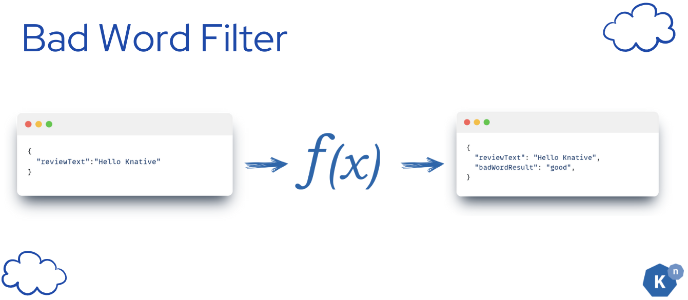

# Create Bad Word Filter Service


As a bookstore owner, you aim to receive instant notifications in a Slack channel whenever a customer submits a new negative review comment. By leveraging Knative Function, you can set up a serverless function that contains a simple bad word filter service to tell whether the text contains any hateful/insultive speech.

If you ever get stuck, check the solution here.

[Solution - Go to Deploy ML workflow: Bad word filter :fontawesome-solid-paper-plane:](../page-3/solution-create-bad-word-filter-service.md){ .md-button .md-button--primary }

## **What Knative features will we learn about?**

- The easiness to use Knative Function to deploy your service, and make it be managed by Knative Serving, which gives you the ability to auto-scale your service to zero, and scale up to handle the demand.

## **What does the final deliverable look like?**



A running serverless Knative Function that contains a python application that receives the new review comments as CloudEvent and returns the result that tells your input text contains any inappropriate languages or not. The result is sent back as CloudEvent.

!!! info
    We are using the `profanity_check` library to detect the bad words in the text. It is a open source library. Please see the disclaimer here. The result may not be 100% accurate.

The function's output will be only from:

- good
- bad

## **Implementation**


The process is straightforward:

1. Begin by utilizing the `func create` command to generate your code template.
2. Next, incorporate your unique code into this template.
3. Finally, execute `func deploy` to deploy your application seamlessly to the Kubernetes cluster.

This workflow ensures a smooth transition from development to deployment within the Knative Functions ecosystem.

---

### **Step 1: Create a Knative Function template**


???+ success "Verify"

    The file tree will look like this:

    ```
    /start/bad-word-filter
    ├── func.yaml
    ├── .funcignore
    ├── .gitignore
    ├── requirements.txt
    ├── app.sh
    ├── test_func.py
    ├── README.md
    └── Procfile
    └── func.py
    ```

### **Step 2: Replace the generated code with the bad word filter logic**


`bad-word-filter/func.py` is the file that contains the code for the function. You can replace the generated code with the bad word filter logic. You can use the following code as a starting point:

???+ abstract "_bad-word-filter/func.py_"
    ```python
    from parliament import Context
    from profanity_check import predict
    from cloudevents.http import CloudEvent

    # The function to convert the bad word filter result into a CloudEvent
    def create_cloud_event(inputText, data):
        attributes = {
            "type": "new-review-comment",
            "source": "book-review-broker",
            "datacontenttype": "application/json",
            "badwordfilter": data,
        }

        # Put the bad word filter result into a dictionary
        data = {"reviewText": inputText, "badWordResult": data}

        # Create a CloudEvent object
        event = CloudEvent(attributes, data)
        return event

    def inappropriate_language_filter(text):
        profanity_result = predict([text["reviewText"]])
        result = "good"
        if profanity_result[0] == 1:
            result = "bad"
        
        profanity_event = create_cloud_event(text["reviewText"], result)
        return profanity_event

    def main(context: Context):
        """
        Function template
        The context parameter contains the Flask request object and any
        CloudEvent received with the request.
        """
        print("Received CloudEvent: ", context.cloud_event)

        # Add your business logic here
        return inappropriate_language_filter(context.cloud_event.data)
    ```

### **Step 3: Configure the dependencies**


The content of `bad-word-filter/requirements.txt`:

???+ abstract "_bad-word-filter/requirements.txt_"
    ```plaintext
    parliament-functions==0.1.0
    alt-profanity-check==1.4.1.post1
    cloudevents==1.10.1
    ```

### **Step 4: Deploy the function to the cluster**


!!! note
    Please enter `/bad-word-filter` when you are executing the following commands.

```plaintext
func deploy -b=s2i -v
```
???+ success "Verify"
    Expect to see the following message:
    ```
    Function deployed in namespace "default" and exposed at URL:
    http://bad-word-filter.default.svc.cluster.local
    ```

## **Verify**


```plaintext
func invoke -f=cloudevent --data='{"reviewText":"I love Knative so much"}' -v
```

???+ success "Verify"
    Expect to receive a CloudEvent response:

    ```plaintext
    Context Attributes,
    specversion: 1.0
    type: new-review-comment
    source: book-review-broker
    id: ebbcd761-3a78-4c44-92e3-de575d1f2d38
    time: 2024-05-27T04:44:07.549303Z
    datacontenttype: application/json
    Extensions,
    badwordfilter: good
    Data,
    {
    "reviewText": "I love Knative so much",
    "badWordResult": "good"
    }
    ```

If you see the response, it means that the function is running successfully.

## **Next Step**


In this tutorial, you learned how to create a serverless function for a simple service that can detect inappropriate languages in text with Knative. 

Next, we'll be learning how to use Knative Sequence to connect the 2 ML workflows and make sure they are executed in the order you want. 

[Go to Create Knative Sequence :fontawesome-solid-paper-plane:](../page-4/create-sequence-to-streamline-ML-workflows.md){ .md-button .md-button--primary }