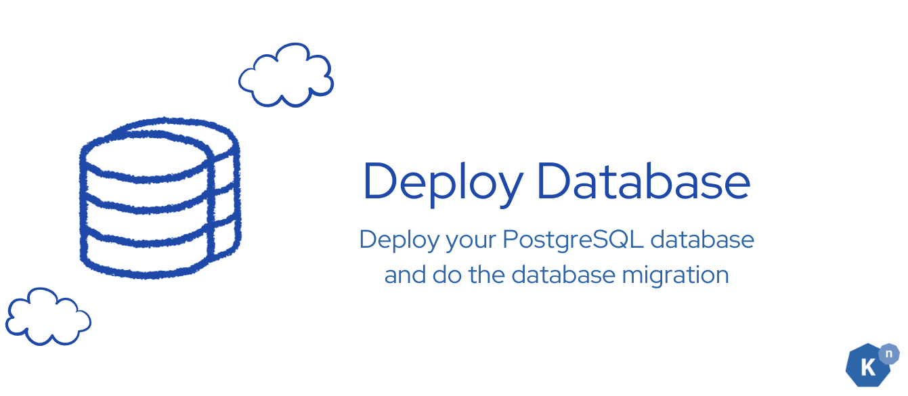
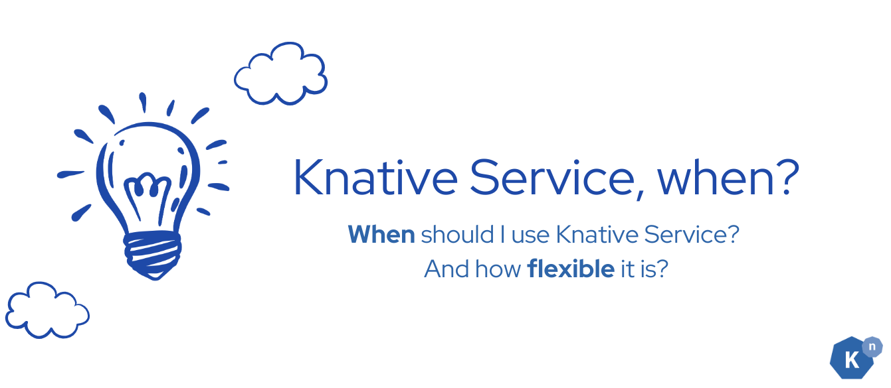
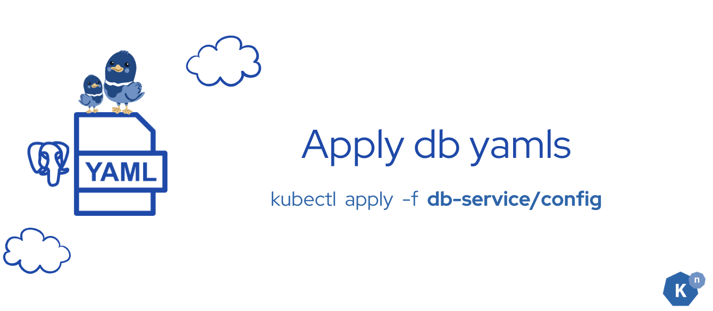
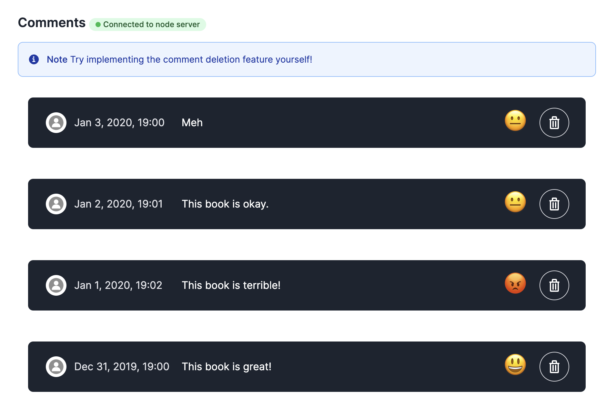

# **5 - Deploy database service**



## **What Knative features will we learn about?**

- When is the best time to use Knative Service

## **What does the final deliverable look like?**

- Running postgreSQL StatefulSet that contains the valid table and some sample data

## **Concept Learning**


**Knative Services** are a powerful feature within the Knative ecosystem, designed to handle a wide range of use cases, especially in modern cloud-native applications, it can be controlled by Knative Serving, and achieve scale to 0 feature. Here’s an expanded explanation of when and why you should consider using Knative Services:

???+ danger "Stateless Workloads"
    - **Definition:** Stateless applications do not store any data locally between requests. Each request is independent and does not rely on any previous interaction.
    - **Use Case:** Examples include web servers, APIs, and microservices where the state is managed externally, such as in a database or a cache.
    - **Benefits:** Simplifies scaling and failover because any instance can handle any request without requiring session persistence.

???+ example "Event-Driven Workloads"
    - **Definition:** Event-driven architectures respond to events or triggers, such as HTTP requests, messages in a queue, or changes in a database.
    - **Use Case:** Use Knative Services to deploy functions that react to events, such as processing incoming data, triggering workflows, or integrating with third-party APIs.
    - **Benefits:** Efficient resource utilization, as services can scale down to zero when not handling events, reducing costs and improving performance.


… More? Try to ask in the Knative Slack community [#knative](https://cloud-native.slack.com/archives/C04LGHDR9K7){:target="_blank"} whether it is the best use case or not.

## **Implementation**

### **Step 1: apply all the config yaml files**



In this section, we will just be simply running a PostgreSQL service. We have all config files ready. Simply run the following command to apply all yamls at once.

```sh
kubectl apply -f db-service
```

???+ success "Verify"

    

    Wait a moment until all the pods become available and the database migration job is completed. If you see some job pods are failing and **having errors, don’t worry**, please wait until at least one job becomes “**Completed**”.

    

## **Verification**


Open the UI page at [http://localhost:3000](http://localhost:3000){:target="_blank"}, you should see some new comments popping up at the bottom of the page.



???+ bug "Troubleshoot"
    If you see “No comments available”, that means your database is not initialized yet. Try to see the health of database service pods and figure out what happened.

## **Next Step**


You have successfully set up the database services, and it is ready to receive requests and store user comments.

Next, we'll complete our event-driven architecture by connecting all the components you created. This is where the magic happens.

[Go to Implement Advanced Event Filtering :fontawesome-solid-paper-plane:](../page-6/pg6-review-svc-2.md){ .md-button .md-button--primary }